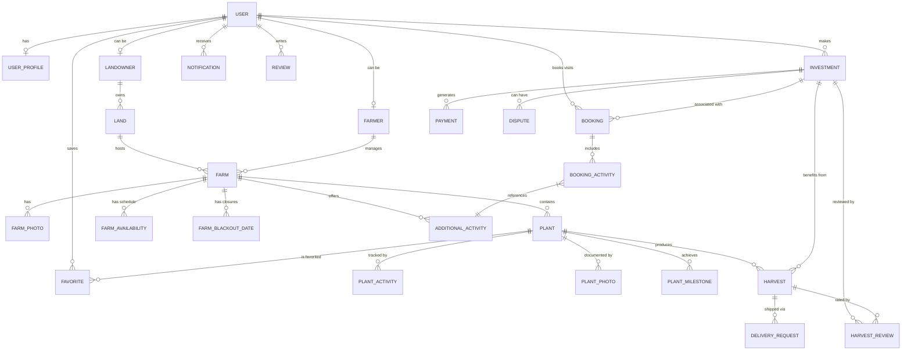

# Database Schema & ERD: Agro-Investment Platform

This document outlines the data model and relationships within the Agro-Investment Platform, as defined in the Prisma schema.

## Entity Relationship Diagram (ERD)

## Core Models

### User & Profile
- **User**: Core authentication entity. Stores identity, role, and verification status.
- **UserProfile**: Extended user information (address, KYC, bio).

### Infrastructure
- **Land**: Physical land owned by a Landowner. Must be verified by admin.
- **Farm**: A farming unit managed by a Farmer on a specific piece of Land. Includes organic status and approval workflow.
- **FarmPhoto**: Media gallery for farms.

### Marketplace & Crops
- **CropType**: Definitions of available crops (growth duration, typical yield).
- **Plant**: Individual units (trees/plants) available for investment. Tracks status from `available` to `harvested`.

### Financials & Investments
- **Investment**: The contract between an investor and a plant. Stores fees, duration, and status.
- **Payment**: Tracks financial transactions (land fees, monthly maintenance, etc.). Supports multiple statuses (`pending`, `completed`, `failed`).

### Operations & Logistics
- **PlantActivity**: Daily/weekly logs of plant care (watering, fertilizing).
- **PlantMilestone**: Key stages of growth (sprouted, flowering).
- **Harvest**: Records of produce yielded. Tracks quantity, quality, and collection method.
- **DeliveryRequest**: Logistics for getting harvest produce to the investor.

### Engagement & Feedback
- **Booking**: Farm visit scheduling for investors. Includes guests and special requests.
- **Review**: User feedback on farms.
- **Favorite**: Bookmark system for plants and farms.
- **Notification**: Alerts for investment updates, payments, and system messages.

### Administration & Trust
- **Dispute**: Resolution system for investment-related issues.
- **PlatformSetting**: Dynamic system configuration.
- **ActivityLog**: Audit trail of user actions for security.

## Enumerations
- **UserRole**: `investor`, `farmer`, `landowner`, `admin`.
- **PlantStatus**: `available`, `sponsored`, `growing`, `harvest_ready`, `harvested`, `inactive`.
- **InvestmentStatus**: `active`, `completed`, `cancelled`, `disputed`.
- **QualityGrade**: `premium`, `standard`, `below_standard`.
- **CollectionMethod**: `self_collect`, `home_delivery`, `donate`, `farmer_keeps`.
